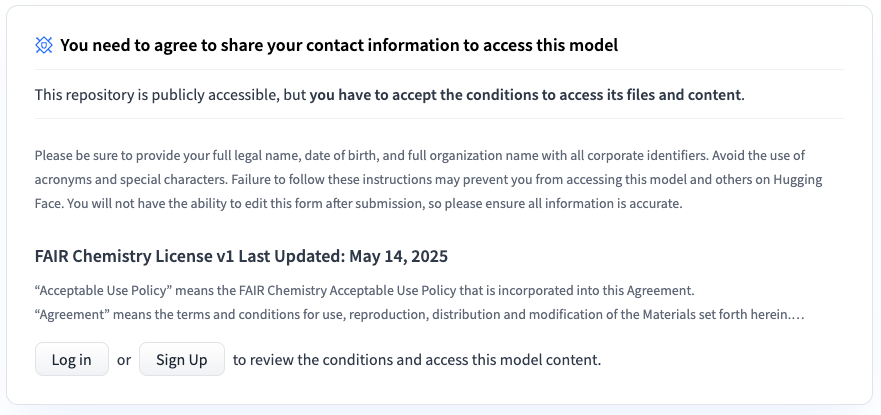
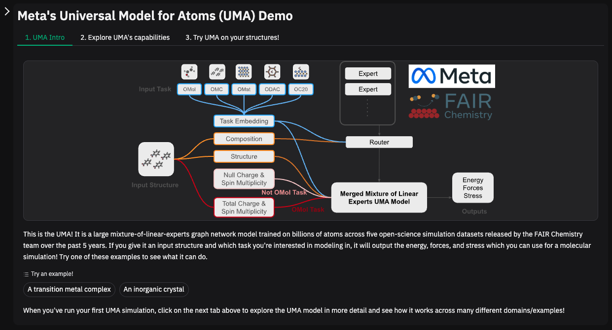
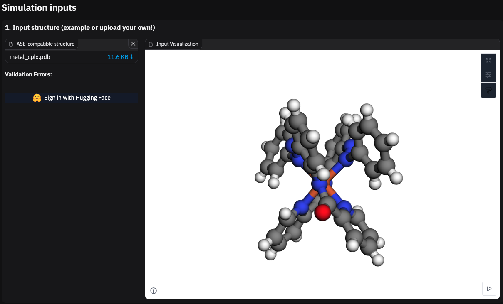
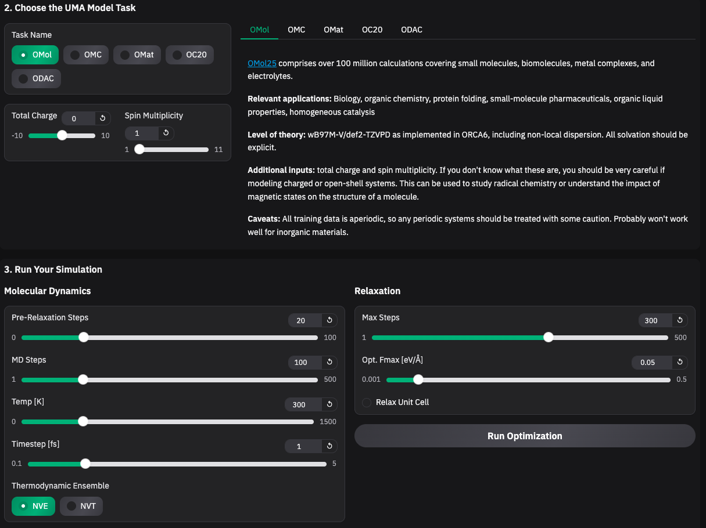
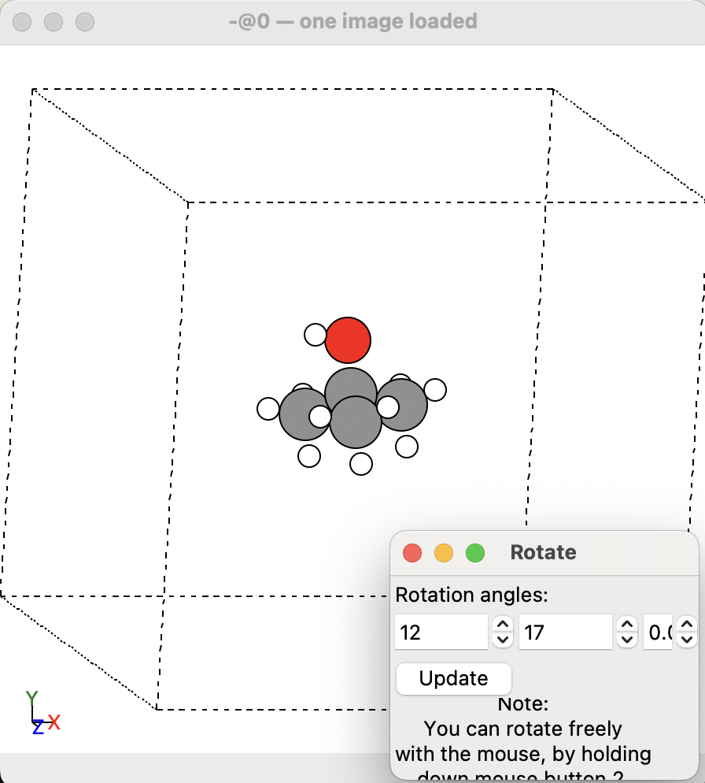

# MetaのFAIRChemモデルの紹介：化学と材料科学のためのAI革命

化学と材料科学の分野は、MetaのFundamental AI Research（FAIR）チームによる最新のリリース、**FAIRChemモデル**により大きな変革を迎えています。このブログでは、FAIRChemとは何か、その主要コンポーネントであるUniversal Model for Atoms（UMA）やOpen Molecules 2025（OMol25）データセット、そして研究者やイノベーターにとってなぜ重要なのかを紹介します。

---

<br><br>

## FAIRChemとは？

FAIRChemは、MetaのFAIR Chemistryチームが開発した、化学および材料科学のためのAI駆動ソリューションを推進する集中型リポジトリです。データセット、事前学習済みモデル、デモ、アプリケーションを統一フレームワークで提供し、研究者が分子や材料の発見にAIを活用しやすくします。MITライセンスの下で公開されており、GitHubやHugging Faceを通じてアクセス可能で、オープンサイエンスとコラボレーションを促進します。

以前はOpen Catalyst Projectとして知られていたFAIRChemは、バージョン2のリリースで大きく進化しました。なお、FAIRChem V2はV1との互換性がなく、従来のモデルやコードは使用できません。

> ⚠️ FAIRChem version 2 is a breaking change from version 1 and is not compatible with our previous pretrained models and code. If you want to use an older model or code from version 1 you will need to install version 1, as detailed here.

---

<br><br>

## 基板モデル
### Universal Model for Atoms (UMA)

UMA（Universal Model for Atoms）は、FAIRChemの中心的なモデルです。分子や材料の原子レベル表現を統一的に扱えるよう設計されており、多様なタスクに応用できます。UMAは、エネルギー推定、力の予測、反応経路解析といった量子化学的な問題に幅広く対応可能です。

UMAの特徴：
- 汎用性：単一モデルで複数の分子・材料シナリオに対応  
- スケーラビリティ：大規模データセットを活用した事前学習  
- 拡張性：Hugging Face Hubを通じて追加のファインチューニングが容易  

これにより、研究者は一からモデルを構築せずに、高度な予測タスクに直接取り組むことができます。

---

<br><br>

## データセット
### Open Catalyst 2020 (OC20) ~ 2022(OC22)

Open Catalyst データセットは、触媒表面に分子が吸着したときの構造やエネルギーを予測するための大規模データセットです。数百万件に及ぶ吸着構造と力・エネルギーラベルを収録しており、触媒設計の加速を目的としています。表面科学やエネルギー変換研究において標準的なベンチマークとなっています。
初版はOC20で現在最新のバージョンはOC22になります。

### OMAT (Open Materials)

結晶や固体材料を対象としたデータセットです。結晶構造やバンドギャップ、安定性といった物性データを収録しており、新材料探索のための重要なリソースとなります。半導体設計やエネルギー材料研究に活用可能です。

### OMOL (Open Molecules)
分子を対象とした大規模データセット。  
数千万分子を網羅し、量子化学計算に基づく高品質ラベルを含む。分子物性予測や薬物探索、材料設計の基盤となる。

### ODAC (Open Direct air capture)
金属有機構造体（MOFs）に特化したデータセット。  
ガス吸着や分離、触媒応用などに広く用いられるMOF材料をカバーし、構造探索や機能予測を支援する。

### OMC (Open Molecular Crystals)
分子結晶を対象としたデータセット。  
有機結晶の安定性や結晶構造予測に利用でき、電子材料や光学材料の設計に重要。

---

<br><br>

## FAIRChemの重要性
FAIRChemは、AIモデルの訓練に必要な包括的で高精度なデータセットの不足という、分子および材料科学の重大な課題に対処します。従来のDFT計算は計算コストが高く、実験的手法は時間がかかります。FAIRChemのデータセットとUMAのような事前学習済みモデルは、高スループットのスクリーニングやシミュレーションを前例のない規模で可能にし、触媒、材料、分子の新たな発見を加速します。

例えば、FAIRChemを活用することで、研究者は以下のようなことが可能です：
- 水素貯蔵などの再生可能エネルギー用途の触媒を最適化する。
- 直接空気回収や次世代コンピューティングハードウェアのための新素材を設計する。
- 生体分子や反応性システムの分子動力学シミュレーションを高精度で実行する。

---

<br><br>

## FAIRChemのインストール
1. FAIRChemを使用するには、Hugging FaceアカウントとUMAモデルリポジトリへのアクセスが必要です。UMAモデルにアクセスするには、連絡先情報を共有することに同意する必要があります。
<div align="center">
  
  <p><em>UMAモデルアクセスするために連絡先情報共有を同意</em></p>
</div>
<br>

2. 仮想環境を作るのをお勧めします。今回はcondaで作ります。
   <br>
   ```
   conda create -n farichem_env
   ```
<br>

3. pipやuvを使ったインストールします。今回はpipでインスタールします。
   <br>
   ```
   pip install ase
   pip install fairchem-core
   ```

---

<br><br>

## Web DEMO
UMAモデルではウェブ上の利用も可能になっています。
<div align="center">
  
  <p><em>UMA　ストラクチャー</em></p>
</div>
<br>

<div align="center">
  
  <p><em>UMAモデル インプット画面</em></p>
</div>
<br>

<div align="center">
  
  <p><em>UMAモデル　セッティング画面</em></p>
</div>

---

<br><br>

## FAIRChemの分子動力学シミュレーション(MD)
今回は例として、tert-butanolのMDを行ってみます。以下はMDを機械学習ベースのポテンシャル、機械学習ポテンシャル (MLIP, Machine Learning Interatomic Potential)で実行するコード です。

1. 必要なライブラリーをインストール
    ```
    from ase.io import write
    from ase.io import Trajectory
    from ase.visualize import view
    from ase.md.langevin import Langevin
    from ase import units

    from fairchem.core import pretrained_mlip, FAIRChemCalculator

    from rdkit import Chem
    from rdkit.Chem import AllChem
    from ase import Atoms
    ```
2. 化学構造は一般的なファイルタイプをサポートする ase.Atoms オブジェクトを作成することでロードできます。本家のサイトでは"H2O"を指定していましたが、ASE の molecule() には “H2O” などのごく基本的な分子だけがプリセットされています。tert-butanolはプリセットに無いため、そのまま molecule("t-BuOH") のようには呼び出せません。そのため**RDKit で SMILES → 3D 座標生成 → ASE へ渡す**という手法を紹介します。
    ```
    # 1. tert-butanolのSMILESを作成
    smiles = "CC(C)(C)O"
    rdmol = Chem.MolFromSmiles(smiles)
    rdmol = Chem.AddHs(rdmol)

    # 2. 3D座標を生成
    AllChem.EmbedMolecule(rdmol, AllChem.ETKDG())
    AllChem.UFFOptimizeMolecule(rdmol)

    # 3. 原子の位置と記号を抽出
    conf = rdmol.GetConformer()
    positions = np.array([list(conf.GetAtomPosition(i)) for i in range(rdmol.GetNumAtoms())])
    symbols = [atom.GetSymbol() for atom in rdmol.GetAtoms()]

    # 4. ASE Atomsオブジェクトを作成
    mol = Atoms(symbols=symbols, positions=positions)

    # 5. 真空パディングを追加
    mol.center(vacuum=5.0)
    mol.pbc = (False, False, False)

    # 6. .trajに保存
    write("tBuOH_pre_md.traj", mol)
    ```
3. 作成したtert-butanolを可視化
    ```
    traj = Trajectory('tBuOH_pre_md.traj')
    view(traj) 
    ```
    <div align="center">
    
    <p><em>tert-butanolの3D図</em></p>
    </div>
<br>

4. MDシミュレーションを実行
    ```
    predictor = pretrained_mlip.get_predict_unit("uma-s-1p1", device="cpu")
    calc = FAIRChemCalculator(predictor, task_name="omol")

    # atoms = molecule("H2O")
    mol.calc = calc

    dyn = Langevin(
        mol,
        timestep=0.1 * units.fs,
        temperature_K=400,
        friction=0.001 / units.fs,
    )
    trajectory = Trajectory("tBUOH_post_md.traj", "w", mol)
    dyn.attach(trajectory.write, interval=1)
    dyn.run(steps=1000)
    ```
<br>

5. MDシミュレーション結果を可視化
    ```
    traj_md = Trajectory('tBUOH_post_md.traj')
    view(traj_md) 
    ```
    <figure style="text-align: center;">
      <video src="img/tBuOH_post_md.mov" controls width="640">
      <p><em>tert-butanolの3D図</em></p>
      </video>
      <figcaption><em>tert-butanolの熱振動シミュレーション</em></figcaption>
    </figure>

---

<br><br>

## 感想
先日紹介したIBMのMIのファウンデーションモデル **FM4M** は、MetaのFAIRChemにおける **UMA** と同様に、材料科学のための基盤モデルを目指すものです。ただし、FM4M は SMILES を中心とした分子表現の学習に基盤を置いているのに対し、UMA は原子座標や結晶構造を直接扱うという点でアプローチが異なります。そのため、IBM のモデルは分子特性予測や創薬研究に強みを持ち、FAIRChem は触媒や無機材料、分子結晶、MOFs までを包括的にカバーし、材料科学やエネルギー分野での活用に直結しています。両者は競合関係ではなく、分子中心と原子・材料中心という補完的なアプローチであり、研究の目的に応じて使い分けることが最も効果的だといえるでしょう。

また、MIの発展においては依然として「データ不足」が大きな課題となっています。シミュレーションデータを基盤として構築されたこれらのファウンデーションモデルは、その制約を補い、膨大な化学空間をこれまでにない速度と精度で探索するための不可欠なツールになると考えています。

---

<br><br>

## 参考資料
[FAIRCHEM repository](https://github.com/facebookresearch/fairchem?tab=readme-ov-file)
<br>[Meta release news](https://ai.meta.com/blog/meta-fair-science-new-open-source-releases/)
<br>[FAIRChem UMA demo](https://facebook-fairchem-uma-demo.hf.space/)
<br>[UMA repository](https://huggingface.co/facebook/UMA)
