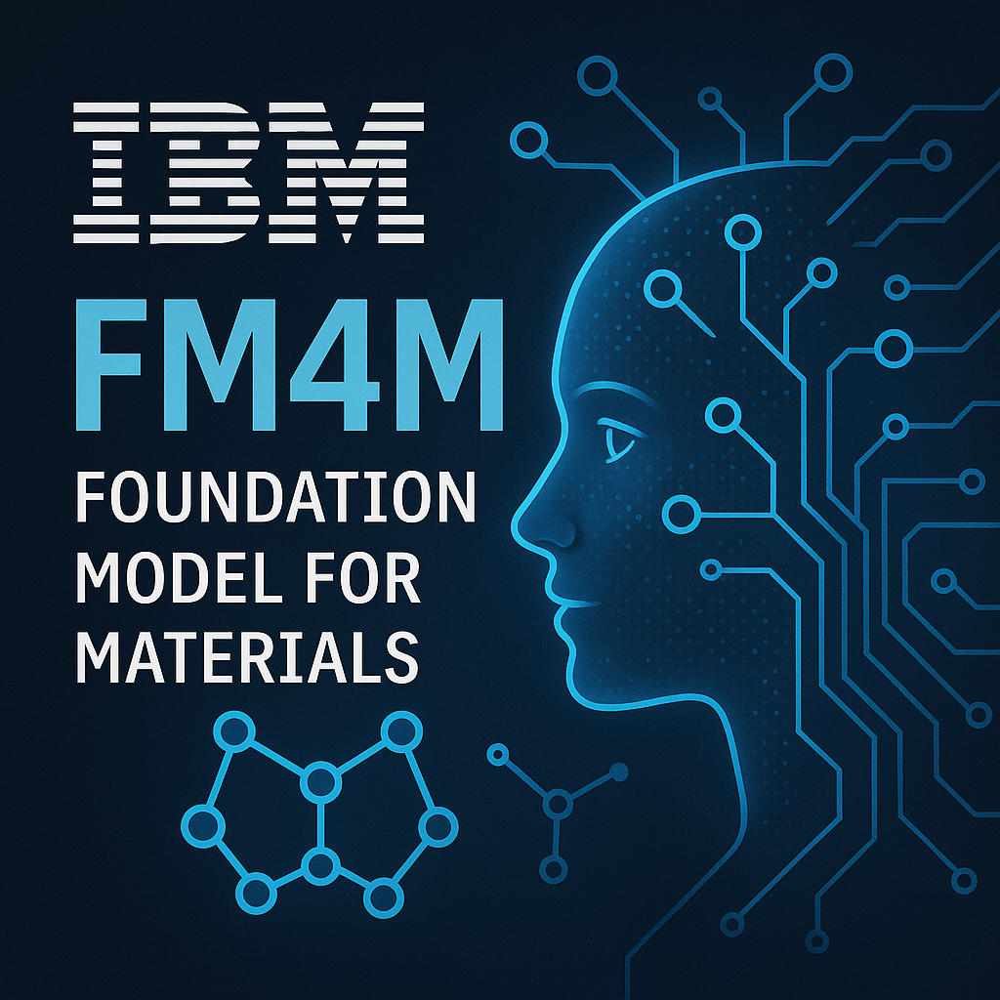

IBMの材料開発向けAIモデル「FM4M」とは？
======================================

   

# 背景
近年、気候変動や環境汚染への対応が求められる中で、従来の有害な物質に代わる新しい機能性材料の開発が、かつてないほど重要になっています。しかし、新しい材料の発見は決して簡単ではありません。膨大な組み合わせの分子を一つずつ合成・評価し、最適な特性を持つものを探すというプロセスは、時間もコストも非常にかかる試行錯誤の連続です。

IBMが開発したFM4M（Foundation Model for Materials）は、材料科学と化学の研究を支援・推進するためのマルチモーダル（MM）な基盤モデルです。​このモデルは、SMILES、SELFIES、分子グラフ、3D原子位置、3D密度グリッドなど、多様な分子表現形式に対応するユニモーダル（UM）モデルで構成されており、各モデルは独自のデータセットで事前学習されています。 ​

FM4Mのアーキテクチャはモジュール式で、各UMモデルを個別に使用することも、複数のモデルを融合してMMな特徴表現を生成することも可能です。​これにより、特定の研究ニーズに応じた柔軟な適用が実現できます。 
   

# FM4Mのアーキテクチャ
FM4Mの使い方として二つのパターンがあります。
 一つ目はUMモデルのみのパターンです。以下の図で例えると、SMILESデータをオートエンコーダを介して潜在変数を生成する。そして生成された潜在変数を用いて、Downstream task（下流タスク）のフェーズで化合物の物性の予測、収率の予測、望ましい物性の分子を生成するなどのタスクを行うことができます。
 二つ目はMMモデルのパターンです。SMILES以外に、グラフ、未実装のテキストとスペクトルなどのデータをそれぞれ個別のUMモデルから潜在変数を生成します。そして同じく生成された潜在変数を用いて、下流タスクのフェーズで予測などを行うことができます。
 どちらのパターンでも、前段の青色のブロックは、潜在変数を生成するモデルの部分になります。生成された潜在変数を用いて、その後の下流タスクに予測AIモデルを構築し、物性予測、理想の分子を生成するなどに活用することができます。

  
  
<em>FM4Mのアーキテクチャー</em>

   

# FM4Mにおける各モデルの紹介

## UMモデル
現在公開している主なUMモデルは以下の五つになります：

**1. SMI-TED（SMILES-based Transformer Encoder-Decoder）**
 ​PubChemから抽出された約9,100万件のSMILESデータ（約40億トークン）で事前学習されたオートエンコーダモデルです。量子特性予測などの複雑なタスクに対応しています。 ​

  
  
<em>SMI-TEDのアーキテクチャー</em>

 
 

**2. SELFIES-TED（SELFIES-based Transformer Encoder-Decoder）**
 SELFIES表記を用いたBARTベースのオートエンコーダモデルで、約10億件の分子データで事前学習されています。分子の表現学習と新規分子の生成が可能です。 ​

  
  
<em>SELFIES-TEDのアーキテクチャー</em>

 
 

**3. MHG-GED（Molecular Hypergraph Grammar with Graph-based Encoder Decoder）**
 ​グラフニューラルネットワーク（GNN）をベースとしたエンコーダと、分子ハイパーグラフ文法（MHG）に基づくデコーダを組み合わせたオートエンコーダモデルです。分子グラフデータに対して高い予測性能を持ち、常に構造的に有効な分子を生成することが保証されています。 ​

  
  
<em>MHG-GEDのアーキテクチャー</em>

 
 

**4. SMI-SSED（SMILES-based State-Space Encoder-Decoder）**
 ​Mambaアーキテクチャを採用したオートエンコーダモデルで、SMILESデータを用いて事前学習されています。効率的で高速な推論が可能です。 

  
  
<em>SMI-SSEDのアーキテクチャー</em>

 
 

**5. POS-EGNN（Position-aware Equivariant Graph Neural Network）**
 3D原子座標を入力として扱える等変性グラフニューラルネットワーク（Equivariant GNN）。空間構造に基づく精密な物性予測が可能で、構造依存性の高いタスクに有効です。

  
  
<em>POS-EGNNのアーキテクチャー</em>

  

## MMモデル

  
  
<em>MMモデルの特徴のイメージ</em>

FM4Mでは、SMILESやSELFIESといった文字列表現だけでなく、分子グラフや3D構造といった異なる表現形式（モダリティ）を活用できます。MMモデルは、これら複数のモダリティから得られる情報を統合し、より正確かつロバストな予測を実現するための仕組みです。

具体的には、各モダリティごとにUMモデルで生成された**潜在変数**を統合し、以下のような利点が得られます：

- 複数視点の統合により物性予測精度の向上
- モダリティ間での情報補完（欠損耐性）
- 予測だけでなく、生成や構造最適化など応用の幅の拡張

特に、材料開発では測定データが一部欠損していたり、複数の表現が混在することが多いため、MM設計は現実的な課題解決にも直結します。
  

## FM4M情報まとめ
FM4Mの公開されている各UMモデルとMMモデルの情報を以下のテーブルでまとめています。
<table border="1" class="dataframe" style="width: 100%; border-collapse: collapse; text-align: center;">
  <thead>
    <tr style="vertical-align: middle;">
      <th rowspan="2" style="text-align: center; vertical-align: middle;">＃</th>
      <th rowspan="2" style="text-align: center; vertical-align: middle;">FMモデルタイプ</th>
      <th rowspan="2" style="text-align: center; vertical-align: middle;">学習データ</th>
      <th rowspan="2" style="text-align: center; vertical-align: middle;">特徴</th>
      <th rowspan="2" style="text-align: center; vertical-align: middle;">Input</th>
      <th rowspan="2" style="text-align: center; vertical-align: middle;">潜在変数タイプ</th>
      <th colspan="3" style="text-align: center; vertical-align: middle;">Output</th>
    </tr>
    <tr>  
      <th style="text-align: center; vertical-align: middle;">予測</th>
      <th style="text-align: center; vertical-align: middle;">分子生成(分子構造最適化)</th>
      <th style="text-align: center; vertical-align: middle;">欠損値補完</th>
    </tr>
  </thead>
  <tbody>
    <tr>
      <td>1</td>
      <td>SMI-TED　→　DS Task</td>
      <td>91M SMILES (4B tokens) from PubChem</td>
      <td>SMILESだけ使用</td>
      <td>SMILES</td>
      <td>uni-modal</td>
      <td>○ 量子力学特性値 物性値</td>
      <td>○ SMILES</td>
      <td>未検証</td>
    </tr>
    <tr>
      <td>2</td>
      <td>SELFIES-TED　→　DS Task</td>
      <td>1B molecule from PubChem + ZINC-22</td>
      <td>SELFIESで分子生成のロバスト性を向上</td>
      <td>SMILES</td>
      <td>uni-modal</td>
      <td>○ 物性値</td>
      <td>○ SMILES</td>
      <td>未検証</td>
    </tr>
    <tr>
      <td>3</td>
      <td>MHG-GNN　→　DS Task</td>
      <td>1.34M molecules from PubChem</td>
      <td>グラフデータでより複雑な構造や精度が重要なときの高度表現</td>
      <td>分子構造Graph data</td>
      <td>uni-modal</td>
      <td>○ 物性値</td>
      <td>○ 分子構造Graph data</td>
      <td>未検証</td>
    </tr>
    <tr>
      <td>4</td>
      <td>SMI-SSED　→　DS Task</td>
      <td>91M SMILES from PubChem</td>
      <td>・AttentionやMLPBlockを持たない簡素化されたアーキテクチャ ・高速な推論（Transformerの約5倍） ・GPUメモリ最適化</td>
      <td>SMILES</td>
      <td>uni-modal</td>
      <td>○ 物性値 収率</td>
      <td>×</td>
      <td>未検証</td>
    </tr>
    <tr>
      <td>5</td>
      <td>POS-EGNN　→　DS Task</td>
      <td>1.5M structures from MPtrj</td>
      <td>分子の立体構造を取り入れている</td>
      <td>Graph data + 3D位置情報</td>
      <td>uni-modal</td>
      <td>○ 物性値</td>
      <td>×
      <td>未検証</td>
    </tr>
    <tr>
      <td>6</td>
      <td>複数uni-modal FM　→　Fused FMs　→　DS Task</td>
      <td>-</td>
      <td>MMで欠損値補完</td>
      <td>多モーダルデータ</td>
      <td>multi-modal ※</td>
      <td>たぶん○</td>
      <td>たぶん○</td>
      <td>○</td>
    </tr>
  </tbody>
</table>
※1　DS Task: Downstream Task 
※2　単独モデルから得られた潜在変数を結合した融合変数
  

## 各モデルの公開情報
各モデルはGithubから単独もしくはPython環境から簡便に操作するためのFM4M Kitというラッパーで利用することができます。

<table border="1" class="dataframe" style="width: 100%; border-collapse: collapse; text-align: center;">
  <thead>
    <tr style="vertical-align: middle;">
      <th rowspan="2" style="text-align: center; vertical-align: middle;">項目</th>
      <th colspan="2" style="text-align: center; vertical-align: middle;">公開</th>
    </tr>
    <tr style="vertical-align: middle;">
      <th style="text-align: center; vertical-align: middle;">単独利用</th>
      <th style="text-align: center; vertical-align: middle;">FM4M Kit ラッパー利用</th>
    </tr>
  </thead>
  <tbody>
    <tr>
      <td>SMI-TED</td>
      <td>○</td>
      <td>○</td>
    </tr>
    <tr>
      <td>SELFIES-TED</td>
      <td>○</td>
      <td>○</td>
    </tr>
    <tr>
      <td>MHG-GNN</td>
      <td>○</td>
      <td>○</td>
    </tr>
    <tr>
      <td>SMI-SSED</td>
      <td>○</td>
      <td>×</td>
    </tr>
    <tr>
      <td>POS-EGNN</td>
      <td>○</td>
      <td>○</td>
    </tr>
    <tr>
      <td>Multi-modal model</td>
      <td>×</td>
      <td>○</td>
    </tr>
    <tr>
      <td>DS Task_予測</td>
      <td>○ （sklearnのライブラリーを使用）</td>
      <td>○</td>
    </tr>
    <tr>
      <td>DS Task_最適化</td>
      <td>×</td>
      <td>×</td>
    </tr>
  </tbody>
</table>
  

## Web UIも提供
 IBMは、Hugging Face Spaces上でFM4M Kitを用いたWeb UIを提供しています。このインターフェーズにより、直感的な操作が可能です。データの選択、モデルの構築、下流タスクのトレーニング、基本的な結果の視覚化まで一連の操作ができます。(画像をクリック)

  
  
<em>Web UI のイメージ</em>

  

## 考えられる応用例
FM4Mは、材料開発におけるさまざまなプロセスにおいて強力なツールとなります。以下に、代表的な応用シーンを紹介します：

1. 新規材料候補のスクリーニング
 数百万件の分子から、目標物性に近いものを高速に選別可能。
 

2. リード化合物の構造最適化
 既知化合物に類似した候補を生成し、性能改善やコスト削減を支援。
 

3. 合成ルートの優先順位づけ（将来的応用）
 合成収率や反応性の予測により、実験前のプロトコル設計が効率化。
 

4. バッテリー材料や触媒の構造探索
 構造-性能相関を学習し、高性能化に向けた分子設計の加速に貢献。
 

5. 逆設計：所望の物性から分子を生成
 ターゲット物性に合致する分子構造を提案する、いわゆる“AI材料発見”が可能。
  

## 今後の展望
IBMのFM4Mは、現在も継続的に開発・拡張が進められています。今後のアップデートで期待されているポイントには、以下のようなものがあります：

1. テキスト情報や実験条件の統合
 化学実験では昔から研究ノートや文献記述などのデータが多く、これらの言語的な情報も取り入れることで、より広範な予測・設計が可能になります。

2. スペクトルデータへの対応
 現在ではまだ公開機能として備えていないですが、実験的な計測データ（IR、NMRなど）との連携により、構造同定や物性検証への応用が期待されます。

3. ファインチューニング機能の拡充
 ユーザー自身のデータセットでモデルを再学習することで、特定用途に最適化されたAIが構築可能に。

4. インターフェーズの進化
 FM4M Kit や Hugging Face 上の統合UIの拡張により、より扱いやすく、アクセスしやすい設計が望ましいですね。
  

# 参考資料
[https://jp.newsroom.ibm.com/2025-01-16-blog-foundation-models-for-materials](https://jp.newsroom.ibm.com/2025-01-16-blog-foundation-models-for-materials "IBM Home Page")
 [https://github.com/IBM/materials](https://github.com/IBM/materials "IBM Materials Github Page")
 [https://huggingface.co/collections/ibm/materials-673465deacbdf38d9c0c6303](https://huggingface.co/collections/ibm/materials-673465deacbdf38d9c0c6303 "IBM Materilas Huggingface Page")
 [https://huggingface.co/ibm-research/materials.pos-egnn](https://huggingface.co/ibm-research/materials.pos-egnn "POS-EGNN Page")
 [Takeda, Seiji, et al. "Foundation Model for Material Science." Proceedings of the Thirty-Seventh AAAI Conference on Artificial Intelligence (AAAI-23), 2023.](https://ojs.aaai.org/index.php/AAAI/article/view/26793 "FM4M paper")
