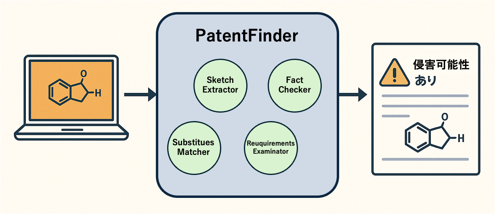

# AIで特許チェック？創薬と知財をつなぐ新ツール「PatentFinder」とは

「この構造、いい活性が出てる。でも特許、大丈夫かな？」――こんな不安を感じたことはないでしょうか？

創薬の現場では、AIによる分子設計が加速していますが、それに伴い特許リスクの見極めがますます重要になってきました。特に、化合物が既存の特許請求項とどの程度似ているか、法的な視点で判断するのは非常に手間がかかる作業だと考えられます。

このブログでは、2024年に発表された論文「Intelligent System for Automated Molecular Patent Infringement Assessment」 [1] を紹介します。この論文で提案された「PatentFinder」というAIシステムは、化合物と特許の類似性を自動で解析し、しかもその結果を人間が理解しやすい形で可視化してくれます。

特許文書を読むのが苦手な化学者にも役立つ「研究サポーター」としてのAIツールについて、その魅力をわかりやすく解説してみます。

---
   

# 化合物に関する特許の問題：なぜ見落としがちなのか

化合物に関する特許は、通常「特許請求項」と呼ばれる文章で記載されています。これは非常に抽象的で、しかも法律用語が多く、実験者が読んでも意味がつかみにくいものです。例えば「～からなる群より選ばれる少なくとも一種」といったマーカッシュ形式[2]などを用いて記載されます。化学構造を具体的に示している場合でも、その周辺の置換基の定義[3]などが広範であったり、上位概念で表現されていたりするため、一見して具体的な化合物をイメージしにくいことがあります。

一方、研究者がAIや直感で新しい分子構造を設計したとき、それが既存の特許に引っかかるかどうかを人力で判断するのは極めて困難です。世界中で日々膨大な数の特許が出願・公開されており、その中から関連する可能性のある特許を全て人力で調査し、複雑な請求項を解釈して抵触するか否かを判断するのは非常に困難な作業です。

つまり、良い分子をせっかく見つけても、「あとから特許侵害だった！」となれば、その分子は使えなくなります。そうなると、時間もコストも無駄になります。

---
   

# PatentFinderとは？AIがやってくれること

論文で提案されたPatentFinderは、AIを使って分子と特許の関係を自動で解析してくれるツールです。

主な特徴は以下の通りです：

- 分子構造（SMILESなど）と特許請求項（テキスト）を入力
- 特許文を読む「文理解エージェント」、分子を読む「分子理解エージェント」など、役割の異なる5つのAIエージェントが協力
- 最終的に「この分子はどの特許と似ているか」「どの箇所が問題になりそうか」を可視化してレポート出力

特に注目すべきは、単に「似てるかも」と判定するだけでなく、**その理由を人が読んで理解できる形で出してくれる**という点です。

こと特徴を持って、化学実験者にとって以下のようなメリットがあります：

- 合成前に、特許侵害の可能性をあらかじめ評価できる
- 無駄な実験やコストを減らせる
- 論文発表・技術移転の際にも安心して進められる

つまり、「特許が怖くて新しい分子を作れない」という心理的ハードルを下げてくれる存在になり得ます。

---
   

# PatentFinderの仕組み

  
  
<em>四つの主要エージェント概要</em>

## 5つの主要エージェントの役割

| エージェント名 | 役割・機能 | 詳細説明 |
|---|---|---|
| **Planner** | 司令塔・プロセス制御 | 全体の流れを設計・制御する司令塔。各エージェントの順序や協力関係を調整し、効率的な解析プロセスを構築します。 |
| **Sketch Extractor** | 分子構造特徴抽出 | 分子構造から特徴的な部分構造や官能基を抽出するエージェント。これにより、どの構造が類似性評価の鍵になるかを明らかにします。 |
| **Requirements Examinator** | 特許要件解析 | 特許請求項のテキストから、化学的な条件や構造的要件を読み取る役割。法的表現を化学的視点に翻訳するようなイメージです。 |
| **Substitutes Matcher** | 構造マッチング評価 | 抽出された分子構造と特許側の要件を突き合わせ、どこが一致・類似しているかを評価。置換基などのバリエーションにも対応。 |
| **Fact Checker** | 妥当性検証・統合 | 最終的な判断の妥当性を確認する役割を持ち、他エージェントの出力を統合して一貫性のある判断へと導きます。 |

 

-> 主な流れとして、構造・要件・マッチング・検証の4段階アプローチで各エージェントが専門性を活かしながらPlannerによる最適化されたワークフロー制御することです

---
  

## PatentFinder Input & Output

| 種類         | 項目                 | 内容                                                 | 形式                                |
|--------------|----------------------|------------------------------------------------------|-------------------------------------|
| **Input** | 分子構造              | 評価対象となる候補分子                               | SMILES（例: `CC(=O)OC1=...`）       |
|              | 特許請求項テキスト     | 分子に対する法的保護内容を記述した特許文書の一部     | 英語の自然言語テキスト（Claims）   |
| **Output** | 侵害リスクの判定       | その分子が特許と類似しているか、侵害の可能性があるか | 「侵害可能性あり／なし」などの定性評価 |
|              | 類似構造の可視化       | 特許と一致・類似している構造を視覚的に表示           | ハイライトされた構造式（画像）     |
|              | 解釈付きレポート        | どの特許と似ているか、どの部分が問題かの説明付き出力 | テキスト＋図（HTMLまたはPDF形式）  |
  

---
   

# PatentFinderは他のLLMより何が優れているのか？

一般的なLLM（大規模言語モデル）は文章生成や質問応答には優れていますが、特許と分子構造のように「テキストと化学構造を結びつけて法的判断を下す」といったタスクには限界があります。PatentFinderはその点において、以下のような点で際立った強みを持っています：

- **役割分担されたマルチエージェント構成**  
各エージェントが異なる視点（化学的・法的・論理的）から分担して解析を行うため、判断の一貫性と精度が高い。

- **解釈可能なアウトプットの生成**  
単なる「似ている」ではなく、「どこがどう似ているのか」を構造式とテキストで明示してくれる。

- **部分的にルールベース／機能分担型で設計されている**  
汎用LLMのように何でも1つのモデルに詰め込むのではなく、役割分担されたエージェントが段階的かつ論理的に処理するため、より高精度かつ解釈可能な結果が得られる。

---
   

# Case Study：LLMとの比較から見えるPatentFinderの強み

  
  
<em>Case study on MolPatent-240</em>

 

| 要素         | LLM単体               | PatentFinder（本手法）              |
|--------------|-----------------------|-----------------------------------|
| 思考プロセス | 例：「似てる」だけ ⇒ 説明が欠けている | エージェントごとに何を処理したか明示 |
| 構造解析     | Markush解釈が雑        | Sketchで抽出＋Substitutesで精密照合 |
| 説明性       | ホールシネーション（hallucination）も | 図＋テキストで理解しやすい可視レポート |

---
   

# まとめと今後への期待

PatentFinderはまだ研究段階のツールですが、今後さらに発展すれば、AI創薬のプロセスに標準装備される可能性もあります。

将来的には、特許情報だけでなく、毒性予測、規制情報、商業的可能性などもLLMモデルで統合的に判断できるようになるかもしれません。AIは難しいものでなく、「実験者の右腕」になる存在。今回の研究は、それを実感させてくれる良い例でした。

ただし一つ残念なところとしては、こちらのモデル時自体はまだ公開のものがなく、実際テストできるものはありませんでした。論文の概念自体は面白く実用性も感じてますが、将来的にオープンのものも出てきましたらより広がるでしょう。

---
   

# おまけ：用語解説

- **特許請求項**：特許文書の中で「どんな技術が権利として保護されるか」を記述した部分。
- **SMILES**：分子構造を文字列で表現する方式。
- **マルチエージェント**：複数のAIモジュールが協力してタスクを進める方式。
- **LLM（大規模言語モデル）**：ChatGPTなど、文章を理解・生成するAIモデル。
---
   

# 参考資料
[1] [Intelligent System for Automated Molecular Patent Infringement Assessment](https://arxiv.org/html/2412.07819v1) 
[2] [マーカッシュクレーム](https://www.hokutopat.com/3985) 
[3][化学分野で特許を取る！](https://patentbox.jp/application-index/%E5%8C%96%E5%AD%A6%E5%88%86%E9%87%8E%E3%81%A7%E7%89%B9%E8%A8%B1%E3%82%92%E5%8F%96%E3%82%8B%EF%BC%81/) 
[4] [マルチエージェント](https://www.ai-souken.com/article/what-is-multi-agent-system) 